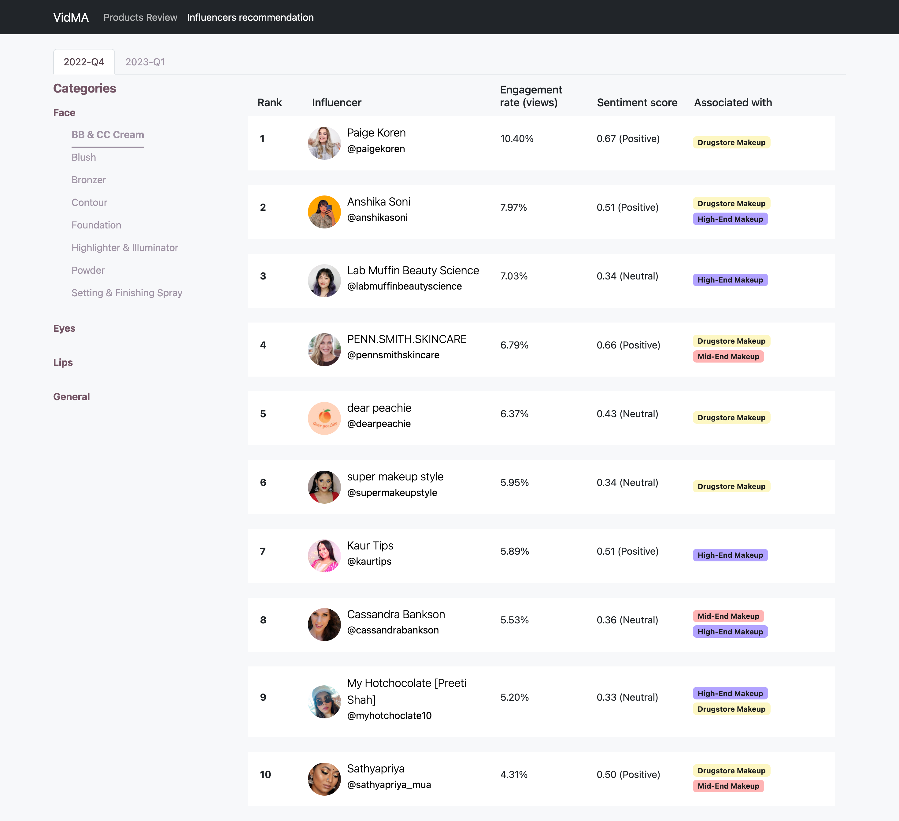
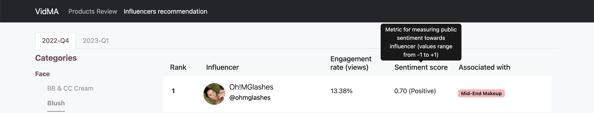

# VidMA
Vid - Video, M - Mining, A - Analysis
A social media analytics project 

## Background & Motivation
With the growing popularity of social media, businesses wants to use the data from social media to understand their customers, competitors & identify market trends. However, they face 2 main issues in doing so. The first issue is related to data collection. With a variety of social media platforms available to collect data from, it is difficult to collect data from them be it manually or automatically due to the huge amount of data and different structure it has. Even though there are APIs available to use, most of the data offered are not comprehensive enough to allow businesses to analyze what they want/need. Some APIs might be unstable as well and some are also costly. The second issue is related to analysis. The processing required for unstructured data collected is complicated and insights cannot be extracted directly from the data collected. Hence, we aim to help businesses to analyze social media data.

## Target user
In particular, we are targeting brands that sells makeup products. For our prototype, VidMA, we are targeting Sephora, a beauty retailer that sells multiple brands and products including its own.

## Innovations
- VidMA uses the valuable data from video-based platforms like YouTube which is under-utilised in existing tools
- VidMA provide actionable insights with aspect-based sentiment analysis
- VidMA empower brands to react to user sentiments efficiently and effectively with influencer identification where influencers are profiled at the product level e.g., lipstick

## Features
1. Aspect-based sentiment analysis on makeup products reviews on YouTube
2. Identify, profile and rank YouTube beauty influencers for each makeup product categories

## Data Collection
- YouTube APIs: Data API v3 to get videos, channels and comments data, Transcript API to get text transcript and raw transcript with timestamps and Operational API to get video chapters
- Sephora website: Scraped the makeup products
- Beauty blogs: Collated a list of beauty brands from the blogs

## Tech Stack
- Python
- Flask framework for the website
- Firebase realtime database for storing of data

## Website
VidMA is hosted on https://vidma.onrender.com/ (P.S. may not be available)
### Products Review

### Influencers recommendation

Influencers are mined on a quartely basis and we have mined influencers' data from 2022 Q4 and 2023 Q1 for our prototype. Users can view each quarter’s data through the tab view, with each tab corresponding to the quarter period and displaying the ranked list of beauty influencers for that quarter. Only one makeup product category’s ranked list of beauty influencers will be shown at a time to avoid overwhelming users. Users can click on navigation links in the collapsible side menu to view other makeup product categories’ ranked lists. Each listed ranked beauty influencer shows their ranking for the period’s product category, YouTube channel’s profile picture, title, custom handle URL (e.g., @shaaanxo), engagement rate by views, sentiment score and label of positive/neutral, and associated brand categories. To view the influencer’s YouTube channel page, users can click on their profile picture, title or custom handle URL to be redirected to the page. As our target users are mainly non-technical people, they might not understand what sentiment score means so there's a tooltip that provides a brief explanation of what it means (see the image below).
 
